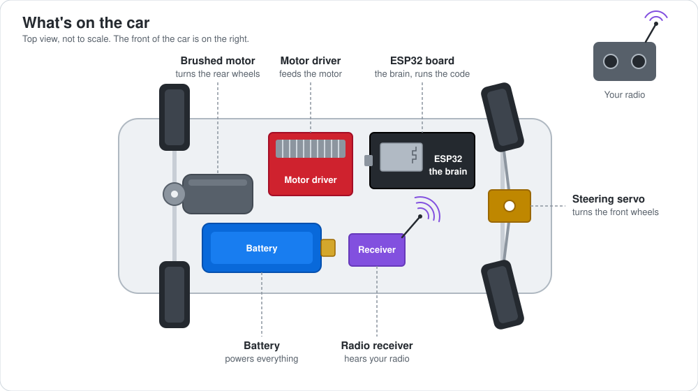
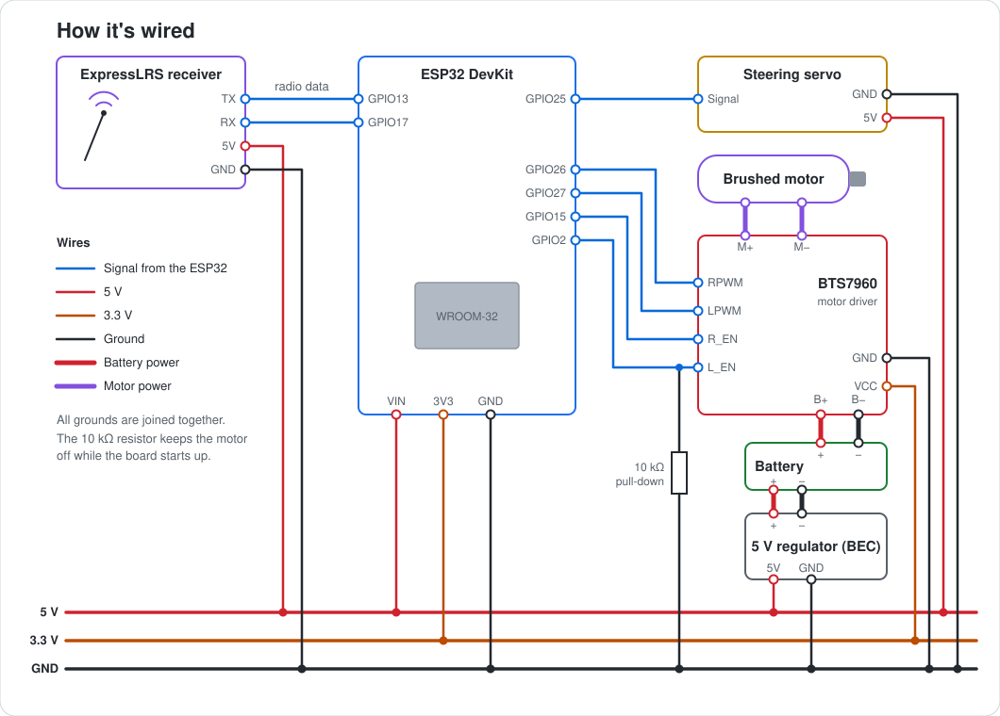
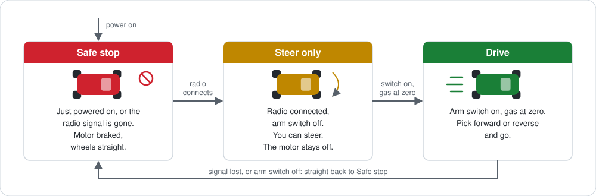

# RC Car on ESP32

A home-built brain for a remote-controlled car. A small ESP32 board listens to a long-range ExpressLRS radio and drives the steering servo and the motor, with an arm switch and a failsafe so the car never runs off on its own.

## What it is

Most hobby RC cars come with a sealed receiver and speed controller. This project replaces them with parts you can buy anywhere and code you can read:

- an **ESP32** development board as the brain,
- an **ExpressLRS** receiver for the radio link,
- a **BTS7960** motor driver that powers a brushed DC motor,
- a standard **steering servo**.

The result drives like any RC car, but every decision about when the car may move is made right here in this repository.

## Features

- **Long-range radio.** Works with any ExpressLRS transmitter and receiver.
- **Smooth control.** Steering and gas follow the sticks, not on/off.
- **Forward, stop and reverse** on a three-position switch. A new direction is accepted only with the gas at zero, so the car never jerks from full forward into reverse.
- **Arm switch.** The motor can't start until you flip the switch, and only with the gas at zero. Switching it off stops the motor at once.
- **Failsafe.** If the radio signal drops, the car brakes and straightens the wheels within a quarter of a second.
- **Safe power-up.** The motor stays off while the board boots, before any code runs.
- **Speed limiter** for the first test drives, currently set to half speed.

## How it works

Your transmitter sends the stick and switch positions to the ExpressLRS receiver on the car. The receiver passes them to the ESP32 over a single wire, many times a second. The ESP32 checks that every packet arrived intact, decides whether the car is allowed to move, and sets the servo angle and the motor power. If the packets stop coming, a timer fires and the car stops.

## Wiring

Three things worth knowing before you solder:

- The **10 kΩ resistor** on the L_EN line holds the motor driver off while the ESP32 boots. Don't leave it out.
- The motor driver's **VCC** pin gets **3.3 V** from the ESP32, not 5 V.
- The receiver, servo and ESP32 run from the **5 V regulator**. The motor driver takes battery power directly, and all grounds are joined.

## Safety

- Right after power-up the car sits in **Safe stop** until the radio connects.
- With the radio connected and the **arm switch off**, you can steer. The motor stays off.
- Flip the **arm switch on** with the gas at zero and the car is ready. Pick forward or reverse on the direction switch and go.
- Lose the signal or switch off, and the car brakes and goes back to Safe stop. To drive again, cycle the arm switch.

When trying new firmware, keep the wheels off the ground.

## Parts

| Part | What it does |
|---|---|
| ESP32 DevKit (ESP32-WROOM-32) | The brain |
| ExpressLRS receiver | Radio link to your transmitter |
| BTS7960 (IBT-2) motor driver | Powers the brushed DC motor, forward and reverse |
| Steering servo | Turns the front wheels |
| Brushed DC motor | Drives the rear wheels |
| 5 V regulator (BEC) | Powers the electronics from the battery |
| 10 kΩ resistor | Keeps the motor off at boot |
| Battery pack | Feeds the motor driver and the regulator |

## Photos

_Photos of the build will appear here._

<!--
Drop images into docs/photos/ and link them like this:

-->

## Status

The firmware drives the car on the bench with the speed limited to 50 %. Next up: verify the failsafe on the real car, then lift the limit.
